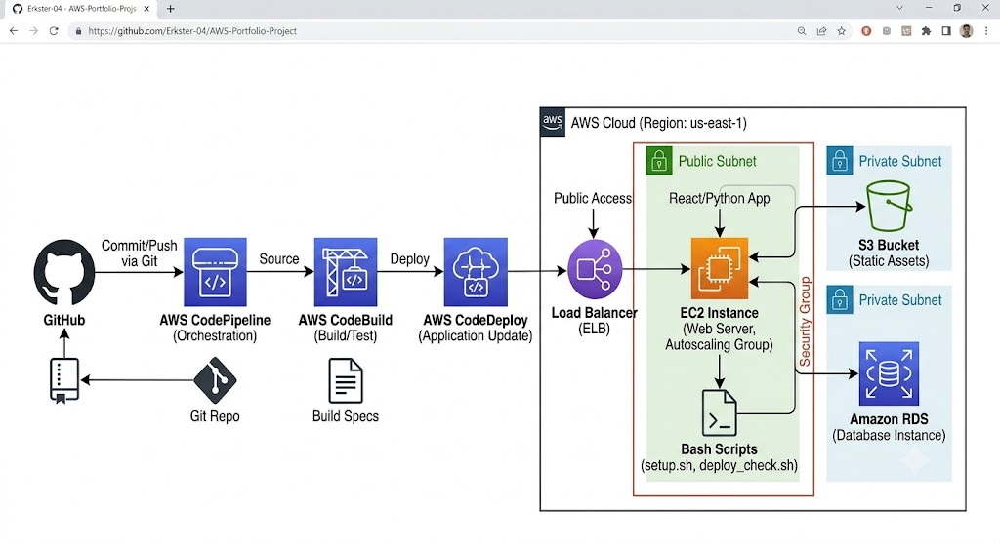

End-to-End AWS Web Application

Project Overview

This project showcases an automated CI/CD pipeline built on AWS to host a dynamic web application. I designed this architecture to demonstrate mastery over cloud resource orchestration, automated deployment, and infrastructure health monitoring.

Technical Stack
Cloud Infrastructure: AWS EC2 (Compute), S3 (Static Asset Storage), RDS (Relational Database).

DevOps & CI/CD: AWS CodePipeline, AWS CodeBuild, AWS CodeDeploy.

Automation: Python and Bash scripting for server-side management and environment verification.

Pipeline Workflow
Source: Every code push to the GitHub repository triggers the pipeline.

Build: AWS CodeBuild compiles the application code and runs tests.

Deploy: AWS CodeDeploy automates the push of the updated application to the EC2 instances, ensuring zero-downtime updates.

Automation & Troubleshooting
This repository includes a custom Bash script, deploy_check.sh, which automates the health verification of the infrastructure.

Health Checks: The script verifies connectivity and status for S3 buckets, RDS instances, and EC2 web servers.

Key Challenges: A major hurdle was configuring the security group rules for the RDS database to ensure it only accepted traffic from the EC2 instance. I resolved this by refining the ingress rules to restrict database access solely to the web server's security group, following the principle of least privilege.
